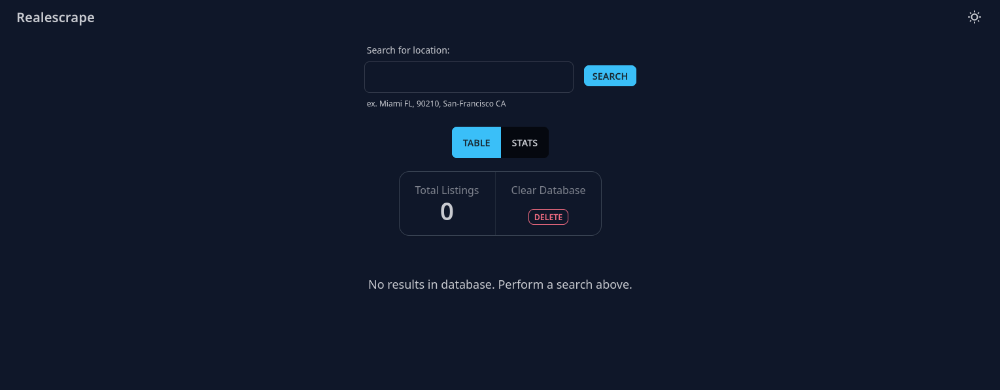

# realescrape-go

 

Rewrite of my [Python based scraper](https://github.com/nronzel/pyrealescrape)
in Go using the [Colly](https://github.com/gocolly/colly) web scraping framework.

> NOTE This project is for educational purposes only. Please use with care.

The frontend is not complete, but is in a useable state. Once everything is spun
up you can use the frontend to start a new scrape, clear out the DB, and you
can currently sort each column in the table. Updates are not automatic, so if
you perform an action (new scrape, or delete data) you must manually refresh
with the refresh button on the page. This will be fixed when I implement SSE
and will have the table update in real time.

## Upcoming

TODO:

- [x] ~lotsize conversion~
- [x] ~ratios~
- [x] ~split utility functions into separate modules~
- [x] ~export to JSON~
- [x] ~combine json files into a master file with all data~
- [x] ~MongoDB~
- [x] ~API endpoint~
- [ ] More robust unit tests
- [ ] Full state searches
- [x] ~Flesh out API~
- [x] ~SSE for realtime updates~
- [ ] Dockerize the app
- [x] ~Split code into separate packages for easier maintanability~

Frontend TODO:

- [ ] Stats page
- [ ] Refactor/clean up the code base
- [ ] Icon on columns headers to indicate sort direction
- [ ] Loading spinner when scrape is active
- [x] ~Column sorting~

## Description

Simple web scraper for Realtor.com.

This program is intended to be run locally only.
I do intend on creating Docker files so you can just run this with Docker.

It also requires a MongoDB instance to be running locally on the default port
with no credentials.

Currently has the following fixed search parameters:

- Single family homes
- Minimum Price - $100,000
- Minimum Bedrooms - 1
- Minimum Bathroom - 1
- Age - 3+
- Hides all houses pending sales
- Hides 55+ communities
- Hides foreclosures
- Sorts by newest listings

#### API

Uses the [Echo](https://echo.labstack.com) framework for the API.

Currently has the following endpoints:

| Method | Endpoint                  | Description                                                                                       |
| ------ | ------------------------- | ------------------------------------------------------------------------------------------------- |
| GET    | `/houses`                 | Gets all items in MongoDB collection                                                              |
| GET    | `/houses?page=1&limit=20` | Takes `page` and `limit` parameters to limit results. `page` acts as an offset based on the limit |
| GET    | `/houses/count`           | Returns the count of all items in the MongoDB collection                                          |
| GET    | `/live`                   | SSE endpoint provides live updates when the collection is updated                                 |
| POST   | `/cleardb`                | Deletes all items in MongoDB collection, and all JSON files in the `/data` directory              |
| POST   | `/scrape/:location`       | Takes a location parameter and scrapes data for the location                                      |

## Installation

#### 1. Install Go

To install and run this scraper locally, you will first need to ensure you have
Go installed on your machine. You can download it and install following
the directions from the [official Golang website](https://go.dev/doc/install).

Be sure to follow the directions for your particular operating system.

#### 2. Clone this repository

Clone this repo to your local machine in whatever directory you choose.

```bash
git clone https://github.com/nronzel/realescrape-go
```

Navigate into the project directory

```bash
cd realescrape-go
```

#### 3. Install dependencies

In the root directory of the project, run

```bash
go get .
```

#### 4. Run the program

Run the program with the following command

```bash
go run main.go
```

When you run `main.go` it will connect to the MongoDB and start the API
on `localhost:3000`.

#### 5. Starting the frontend



In another terminal window, navigate into the `/frontend/realescrape` directory
in the project and then run the command to run the dev
server for the frontend.

```bash
npm run start
```

Or if you use pnpm

```bash
pnpm run start
```

You can then go to `localhost:3100` in your browser to interact with the frontend.

**Locations must be entered in the following formats:**

`"Miami FL"` - separate location and state, state must be capital

`"San-Francisco CA"` - use a hyphen for locations with spaces

`"90210"` - you can also just use a zip code

> Currently will not work for full state searches (e.g. "Florida"). The url can't
> take a radius parameter. This will be remedied in the future.

When the program is complete, you will see some stats in the console on how many
listings were scraped, how long it took, etc.

### Issues

#### Known Issues

1. Bad location

If a location is provided with no results the site will still return a 200 response,
but the page will say "No results found". I will need to add a check for this
wording on the page and if so I will need to somehow update the client.

2. Refreshing page

If the page gets refreshed the SSE connection gets messed up and it doesn't
receive the messages from the SSE endpoint. I will need to implement something
that will fix this and check if the connection was terminated.

3. Load More issue

Currently the load more button will sometimes show duplicate entries. This is
an issue with how it is being displayed and will be fixed.

---

If you run into any problems you can open an issue, or submit a pull request.
